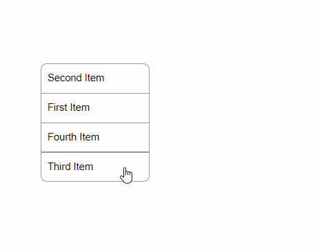

### Прикрепление файла

Реализована возможность прикрепления файла и отображения его превью 

___

### Перетягивание файла

С помощью __Drag and Drop API__ выполнен механизм перетягивания локального изображения на страницу и отображение его превью

___

## Перемещение элемента

В данной реализации этот механизм можно использовать внутри одного блока. Кликнув на итем и перместить его на другую позицию в блоке

